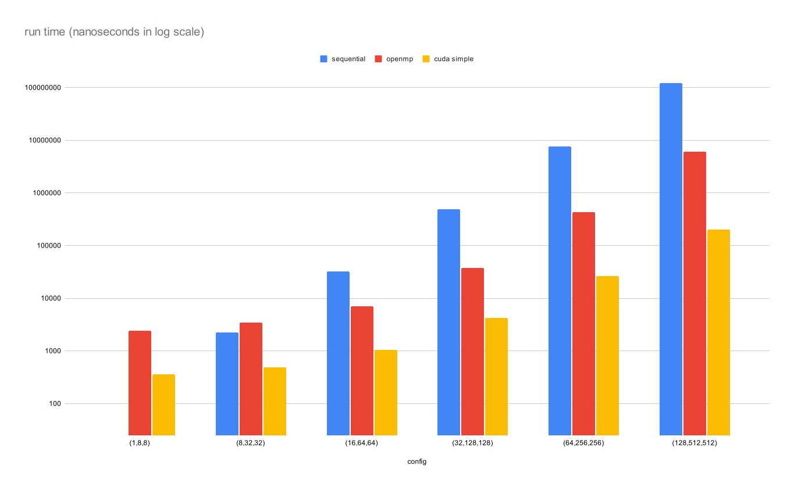
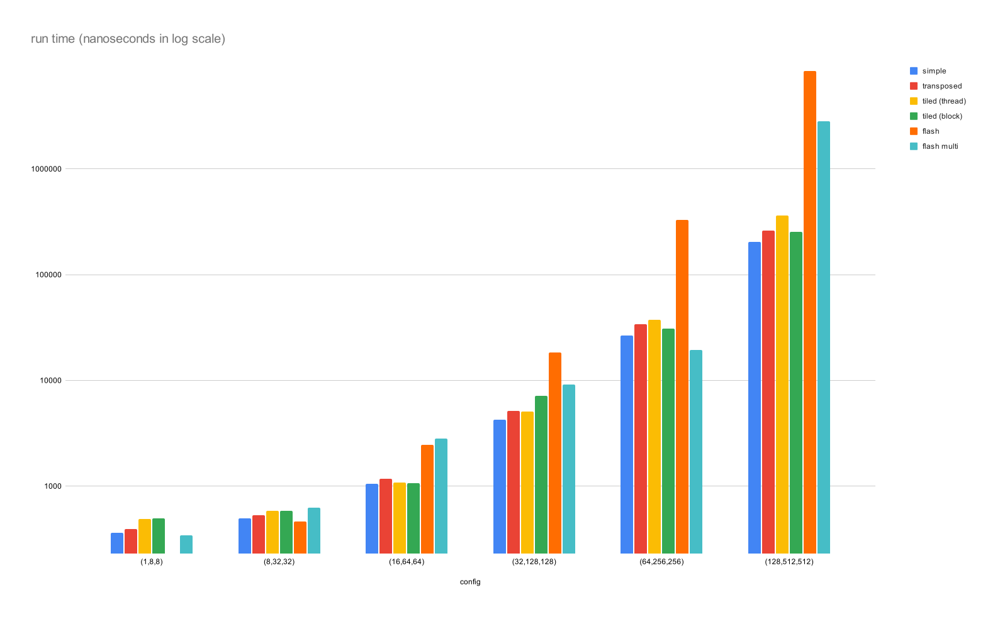
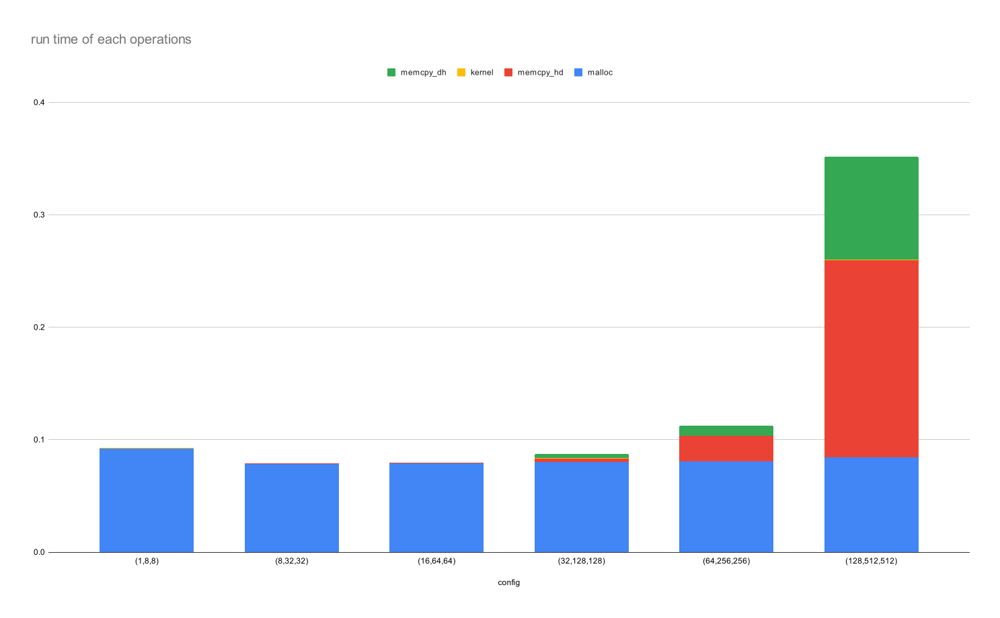
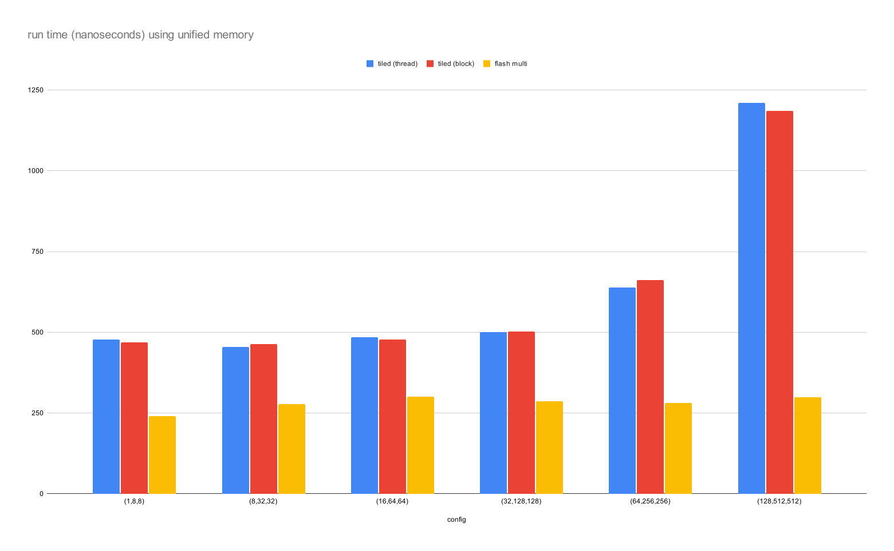

## Experiments

config: (num_batch, sequence_length, embed_dim)

Steady trend of accleration observed, though offset by CUDA's memory overlead at small size

Tranposed version generally took longer time than simple, possibly due to additional transposing overhead. Following variations (i.e. tiled) were then built upon non-transposed simple version

Tiled (block) outran tiled (thread) with larger reduction ratio;
yet are still on par with transposed version, hypothesized that requirement of tiling method on shared memory limited number of threads.

Flash attention scaled with larger overhead, investigated that tiling was coupled with embed dimension $d$, as oppsed to a pre-defined *tile_width*.

Flash multi gave halved speeds from being run on GPU server with 2 devices.

Tiles versions were tested with various *tile_width*, 8x8 was the best on GeForce GTX TITAN X (Maxwell)

Operations were timed separately, memory allocation and copying between host and device used most compute, aligning well with the IO-bound insight raised in [FlashAttention](https://github.com/Dao-AILab/flash-attention).

Unified memory with cudaMallocManaged() as opposed to conventional cudaMalloc() and cudaMemcpy();dynamic memory management eliminated part of memory overload, run time consequently shrank into kernel execution only.
